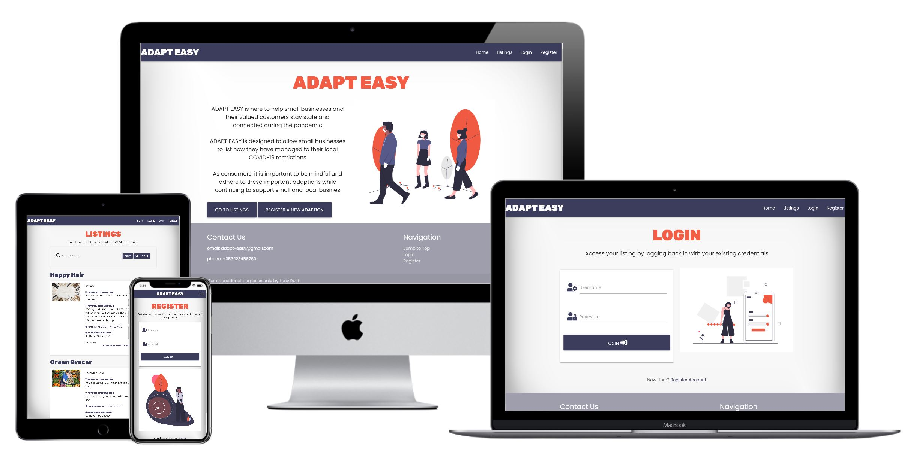
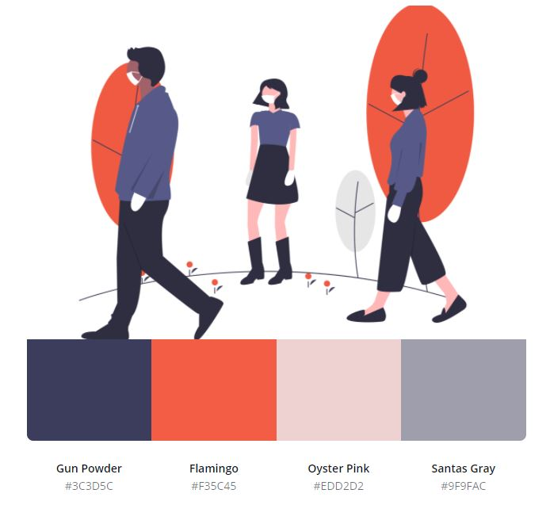

# **Adapt Easy**

View live project here 

Adapt Easy is a full stack application targeting small business owners and their customer bases. It allows both small business owners/managers and their customers to see how their business has adapted to suit new COVID requirements. It will allow businesses to effectively communicate these adaptations to their customers in a clear way to make sure everyone stays safe during the pandemic.

Small business owners will be able to give a short description of their business, the COVID adaptation requirements and the time until this adaption will be implemented. Customers will also be able to see if wearing a mask is required to visit the business. Business owners will be able to create listings, update them and delete them as COVID requirements and restrictions change. 

**For viewing and assessing pruposes, an admin account has been made. Username: Admin, Password: Admin**

# Table of Contents

1. [User Experience](#user-experience(ux))
  - [User Stories](#user-stories)
  - [Design](#design)
    - [Colour Scheme](#colour-scheme)
    - [Typography](#typography)
    - [Imagery](#imagery)
2. [Wireframes](#wireframes)
3. [Features](#features)
  - [Existing Features](#existing-features)
    - [Features On All Pages](#features-on-all-pages)
    - [Features Of Individual Pages](#features-of-individual-pages)
  - [Features Left To Implement](#features-left-to-implement)
4. [Technologies Used](#technologies-used)
  - [Front-End Technologies](#front-end-technologies)
  - [Back-End Technologies](#back-end-technologies)
  - [Database Schema](#database-schema)
5. [Testing](#testing)
  - [Validator Testing](#validator-testing)
  - [Functional Testing](#functional-testing)
6. [Deployment](#deployment)
  - [Local Deployment](#local-deployment)
  - [Remote Deployment](#remote-deployment)
7. [Content](#content)
  - [Media](#media)
  - [Credits](#credits)

# User Experience (UX)

## User Stories

### First Time Visitor Goals

- As a First Time Visitor, I want to easily understand the main purpose of the site and learn more about why the app exists. 
- As a First Time Visitor, I want to be able to easily navigate throughout the site to find content relevant to me.
- As a First Time Visitor, I want to be able to see which businesses have had to adapt their services due to COVID and how these adaptations may affect me as a consumer.
- As a First Time visitor, I would like to be able to see if the site would be relevant to me should I have my own small business that has been affected by COVID

### Returning Visitor Goals

- As a Returning Visitor, I want to find information about signing up or registering for an account. 
- As a Returning Visitor, I want to easily see how to add my own listing for my business and the adaptations I have made to the service.
- As a Returning Visitor, I want to be able to see how the listing looks in comparison to other listings. 

### Frequent User Goals
- As a Frequent visitor, I want to be able to easily navigate to the Login information
- As a Frequent User, I want to check to see if the small businesses close to me have changed the way their service has run and until when these changes will be actioned.
- As a Frequent User, I want to be able to view my listings, update the listing to any new changes, and delete any my listings should they no longer be relevant. 
- As a Frequent User, I want to be able to easily Logout to end the session. 

## Design

Overall, the design of this site is meant to be simple, easy to see and understand, and accessible for all users. 

This application is aimed at both the concious consumer and cautious business owner. During COVID-19 is of utmost importance that we make use of the local services to help 'keep the lights on' while still focussing on the safety of the staff. 

The overall design idea behind this was to keep the application as accessible for all users.

Adapt Easy is easily navigated. Users can easily log in and out of the session and will see different parts of the app when session use is logged in. 

Adapt Easy pages primarily consist of three sections each: 

1. Navbar
A responsive navbar with links to Home, Listings, Profile, Login, Register, Logout, and New Listing pages. 

2. Main Action Section
This is where the information for the user lies, be it the information of the site itself, how the user actions the CRUD functionality, how the user logs in or registers an account.

3. Footer
A responsive footer, with Contact Details, links for the login, register, as well as the Home Page.

When the user is logged in they will be able to direct themselves to the Home, Listings, Profile, New Listings and Logout pages
When there is no current session user logged in, they will be able to access the Home, Listings, Login and Register Page

### Colour Scheme

I made use of primarily the following four colours throughout Adapt Easy

### Typography

The Poppins font is the main font used throughout the site with Sans-serif as the fallback in case the font is not being imported into the site correctly. 

The Rubik font is used for the main headings on each of the pages, as well as the Brand Logo in the nav bar. This font is popular in current stylish sites and is easily read. Sans-serif is the fallback as well. 

### Imagery

Imagery is important to creat an eye-catching site. There are images primarily on the Home, Login and Register pages. There is an image in the New Listings page of an empty city to signify what busy cities now look like due to restrictions. 

## Wireframes

- Desktop
  - [Home](wireframes/desktop/about_desktop.JPG)
  - [Register](wireframes/desktop/register_desktop.JPG)
  - [Login](wireframes/desktop/login_desktop.JPG)
  - [New Listing](wireframes/desktop/new_listing_desktop.JPG)
  - [Listings](wireframes/desktop/listings_desktop.JPG)
  - [My Listing](wireframes/desktop/my_listingt_desktop.JPG)

- Tablet
  - [Home](wireframes/tablet/about_tablet.JPG)
  - [Register](wireframes/tablet/register_tablet.JPG)
  - [Login](wireframes/tablet/login_tablet.JPG)
  - [New Listing](wireframes/tablet/new_listing_tablet.JPG)
  - [Listings](wireframes/tablet/listings_tablet.JPG)
  - [My Listing](wireframes/tablet/my_listing_tablet.JPG)
  
- Mobile
  - [Home](wireframes/mobile/about_mobile.JPG)
  - [Register](wireframes/mobile/register_mobile.JPG)
  - [Login](wireframes/mobile/login_mobile.JPG)
  - [New Listing](wireframes/mobile/new_listing_mobile.JPG)
  - [Listings](wireframes/mobile/listings_mobile.JPG)
  - [My Listing](wireframes/mobile/my_listing_mobile.JPG)

The current site layout is different to the wireframes due to a change in image choices and colour scheme.

# Features

## Existing Features 

### Features on all pages

#### Navbar
- There will be a difference in the navbars that is depenndent if the user is logged in or not by using their username and password. A jinja loop is used to determine which navbar to display
  - If not in session:  the homepage, listings page, register page and login page will be displayed. With a responsive navbar that contains links to the Home, Register and Login pages.
  - If in session: the homepage, listings page, profile page, new listing page and logout will be displayed. This is also responsive. 
 
#### Footer 
- A footer is at the bottom of every page 
  - The footer contains the contact details of the Adapt Easy creators, links to top of the page, login page and the register page. 
  - The footer is responsive

### Features of individual pages

#### Home Page 
- The hero image
  - The hero image is on 3 people walking a safe distance from each other, wearing masks. This image is a sign of times and a sight that all of us are used to by now!
 
- Adapt Easy Description
  - This is a short 3 paragraphs used to introfuce the user to the app and how the app may benefit them as a concious consumer or a small business owner. 
 
- Extra Navigation Buttons
  - These two buttons are a quick way for a consumer to navigate to the listings page or a small business owner to the register page to get started. These buttons allow for easy navigation for new users

#### Register and Login Pages

- These pages both follow the same structure:
  - Main Image to the left of the page.
  - Form with username and password input as well a submit button.
  - A discrete link to either the Login/Register page should the user see they may still need to set up their account or can simply login
 
 #### Listings Page
 
- In the centre of the page,a search panel for the listings as well as a card panel is displayed for each listing
  - The search panel will allow the user to search for keywords that may appear in the business name and description
  - Upon loading, the card panel displays the business name, description, adaption description, date the adaption is valid until and if the user is logged in an Edit and Delete button
  
#### New Listings Page

- The new Listings page contains two main elements
  - A form that is used for the user to input details about their busines’s adaption for COVID restrictions. There are eye catching icons for each of the input fields which can help the user navigate through the form. The form contains a submit button. 
  - An image at the bottom of the page

#### Profile Page 

- Similar to the Listings page, the profile page allows the current session user to see all of their listings. Each of the card panels also contain an Edit and Delete buttons to allow the user to edit their own listings.

## Features Left To Implement 

There are several features planned for future implementation of this project 

- Pagination
  - This could allow the user to click through the listings instead of scrolling down the page

- Maps API
  - This feature could allow the user to see exactly where the listed businesses are located in order to track those in their local area 
  - This feature would also allow users to see more bsuiness details as listed on Google

- Sharing listings with other
  - This feature will allow the user to easily share their business adaption with other to help spread the word, not COVID!

# Technologies Used

- Gitpod - Used as the IDE for this application.
- Github used for the remote storage of the code online.

## Font-End Technologies
- HTML - Used to create the structure of the application.
- CSS - Used as the base for styling.
- Javascript - Used to create interactivity within the project
- JQuery - Used for some of the main javascript functionality.
- Materialize - Used  as the design framework.

## Back-End Technologies
- Flask - Used as the microframework.
- Jinja - Used for templating with Flask.
- Heroku - Used to host the application
- Python - The back-end programming language.
- Pymongo - Used to connect the python with the database.
- MongoDB Atlas - Used to store the database.

## Database Schema
- The application uses MongoDB for data storage. MongoDb was chosen as the database to use due to the unstructured format of the data that will be stored within it. 
- The data stored in the database are the following:
  - Object ID
  - String
 
### There are Three Core Collections within the Database 

#### Users

| Title         | Key in db     | for validation type  | Data Type |
| ------------- |:-------------:| --------------------:|----------:|
| Account ID    | _id           | none                 | ObjectID  |
| Username      | usrename     |   username            |    string |
| Password     | password      |    password           |   string  |

#### Categories

| Title         | Key in db     | for validation type  | Data Type |
| ------------- |:-------------:| --------------------:|----------:|
| Category ID    | _id           | none                 | ObjectID  |
| Category Name      | category_name     |   text      |    string |

#### Adaptions

| Title         | Key in db     | for validation type  | Data Type |
| ------------- |:-------------:| --------------------:|----------:|
| Adaption ID   | _id           | none                 | ObjectID  |
| Category Name      | category_name     |   text      |    string |
| Business Name      | business_name     |   text      |    string |
| Business Description  | business_description   |   text      |    string |
| Adaption description  | adaption_description    |   text      |    string |
| Mask Mandatory     | valid_until    |  checkbox     | text  |
| Image URL      | img_url     |     url  |  text |
| Website URL      | website_url     |     url  |  text |
| Created By      | created_by     |  text   |  string |

# Testing 

## Code Testing 

### Validator Testing 

[W3C Markup Validation](https://validator.w3.org/nu/#textarea)

- HTML 
  - No errors in HTML were notes
  
- CSS
  - No errors in CSS were noted

 [JSHINT](https://jshint.com/)

- When run through the [JSHint validator](https://jshint.com/) these metrics were returned:
  - There are 7 functions in this file.
  -  Function with the largest signature take 0 arguments, while the median is 0.
  -  Largest function has 7 statements in it, while the median is 3.
  -  The most complex function has a cyclomatic complexity value of 3 while the median is 2..

- Two warnings
  - 28	'let' is available in ES6 (use 'esversion: 6') or Mozilla JS extensions (use moz).
  -  29	'let' is available in ES6 (use 'esversion: 6') or Mozilla JS extensions (use moz).

- One undefinied variables were noted which are due to the use of JQuery:
  - $

[Python PEP8](https://pypi.org/project/autopep8/)

- The autopep8 extension was installed in the workspace.

- To install this enter this in the terminal:
  - `pip3 install --upgrade autopep8`

- Then, you can format the code into PEP8 formatting by entering this command into the terminal:
  - `autopep8 --in-place --aggressive --aggressive app.py`
  
Due to my overall experience with Python, I elected not to follow the PEP8 formatting during the creation of the application, however decided to format the code into PEP8 after the app.py was written.

Now after this application is complete, I am more aware of the requiremetns to follow t follow the PEP8 formatting and will be following this in the future.

When the ``app.py`` code is pasted into PEP8 checker, no errors appeard 
- ([Results](http://pep8online.com/checkresult))

### Known Issues 
- Resolved 
  - The colour scheme did not suit the images that I originally used therefore had to get a new colour scheme
  - The profile page was showing all listing, not restricting to just the session user
- Unresolved
  - The two buttons on the home page may not look the best on smaller screens, due to a restriction in time I did not get to solve this issue. 
  - The listings can look squashed on smaller screens
  - The forms validation still make use of the standard materialize colours, this does clash with the new colour scheme

## Functional Testing

Testing User Stories from User Experience (UX) Section

### First Time Visitor Goals

- As a First Time Visitor, I want to easily understand the main purpose of the site and learn more about why the app exists. 
  - The hero image on the Home Page clearly indicates that this site is COVID-related
  - The introduction to Adapt Easy is easily understood, it allows both consumers and small business owners to understand the purpose of the site
- As a First Time Visitor, I want to be able to easily navigate throughout the site to find content relevant to me.
  - There are two buttons in the middle of the page that prompts the user to navigate themselves to the listings or register page
  - The site has been designed to be fluid and never to entrap the user. At the top of each page there is a clean navigation bar, each link describes what the page they will       end up at clearly
  - At the bottom of the first 3 pages there is a redirection call to action to ensure the user always has somewhere to go and doesn't feel trapped as they get to the bottom of      the page
  - On the New Listing Page, after a form response is submitted, the page refreshes and the user is brought to the top of the page where the navigation bar is.
- As a First Time Visitor, I want to be able to see which businesses have had to adapt their services due to COVID and how these adaptations may affect me as a consumer.
  - Upon navigating to the Listings page, the user can easily see a lit of all the business adaptions
  - The user can easily search for keyword that may be included in the business name and description
  - Th business adaptions are clearly layed out and easily read 
- As a First Time visitor, I would like to be able to see if the site would be relevant to me should I have my own small business that has been affected by COVID
  - As a small business owner, the user can follow the prompt to register from the home page 
  - Without Login or Register details, the user would still be able to see the Home page and the Listings page to immediately see if Adapt Easy would be useful for them 

### Returning Visitor Goals

- As a Returning Visitor, I want to find information about signing in or registering for an account.
  - Upon visiting the Home page, the user can easily navigate to the Register page via the navbar or the prompt on the Homepage to to create their username and password.
  - The Registration will be confirmed by a clear Flash message
- As a Returning Visitor, I want to easily see how to add my own listing for my business and the adaptations I have made to the service.
  - Once the user is logged in, they are easily able to navigate to the Profile page where they are able to see exactly which Listings they have uploaded
- As a Returning Visitor, I want to be able to see how the listing looks in comparison to other listings. 
  - The session user is able to navigate from the Profile page directly to the Listings page where they can easily compare their own listing to others. 

### Frequent User Goals
- As a Frequent visitor, I want to be able to easily navigate to the Login information
  - The user will be able to navigate to the Login page via the navbar, where they can login with their username and passowrd
  - A flash message will confirm that the Login was successful, making it clear that the user has started the session
- As a Frequent User, I want to check to see if the small businesses close to me have changed the way their service has run and until when these changes will be actioned.
  - The user will be able to get a lot of information about business adaptions by navigating to the Listings page
  - The user can see that the listings are easily read and include small pictures of their business
- As a Frequent User, I want to be able to view my listings, update the listing to any new changes, and delete any my listings should they no longer be relevant. 
  - As a user that has logged into their account, they will be able to see exactly which listings they can edit 
  - The user is easily able to read the information they currently have listed
  - The user can follow the Edit button, they will be directed to a form which has been auto filled with the existing adaption details, the user is easily able to adjust these     details
  - The user is able to hit the Delete button in order to remove their listing from their Profile and the Listings page should they no longer be relevant
- As a Frequent User, I want to be able to easily Logout to end the session. 
  - There is a easily noticed Logout button in the navbar where the user is easily able to end the session

# Deployment

## Local Deployment 

### To run this project locally

In order to run this project locally, you will need to install the following:
- An IDE, such as [VS Code](https://code.visualstudio.com/)
- [PIP](https://pip.pypa.io/en/stable/installing/) to install the app requirements.
- [Python3](https://www.python.org/downloads/) to run the application
- [GIT](https://www.atlassian.com/git/tutorials/install-git) for version control
- [MongoDB](https://www.mongodb.com/) to develop the database.
 -Once this is done, you will need need to download the .ZIP file of the repository, unzip this file and then in the CLI with GIT installed, enter the following command:
  - ``https://github.com/lucyrush/adapt-easy.git``

- Navigate to the to path using the ``cd`` command.

- Create a `.env` file with your credentials. Be sure to include your `MONGO_URI` and `SECRET_KEY` values.

- Install all requirements from the ``requirements.txt`` file using the following command:
  - ``sudo -H pip3 -r requirements.txt``

- Sign up for a free account on MongoDB and create a new Database called adapt-easy. The names of the databases collections can be found in the database schema section.

- You should then be able to launch your app using the following command in your terminal:
  - ``python app.py``

## Remote Deployment 

- Create a ``requirements.txt`` file using the terminal command ``pip freeze > requirements.txt``
- Create a Procfile with the terminal command ``echo web: python app.py > Procfile``
- ``git add`` and ``git commit`` the new requirements and Procfile and then ``git push`` the project to GitHub.
- Navigate over to [Heroku](https://id.heroku.com/login)
- Click the "new" button, give the project a name & set the region to Europe.
- From the heroku dashboard of your newly created application, click on "Deploy" > "Deployment method" and select GitHub.
- Confirm the linking of the heroku app to the correct GitHub repository.
- In the heroku dashboard for the application, click on "Settings" > "Reveal Config Vars".
- Set the following config vars:

| KEY           | Value         | 
| ------------- |:-------------:| 
| DEBUG          | FALSE         | 
| IP            | 	0.0.0.0      |
| PORT          | 5000           | 
| MONGODBNAME   | <database_name>   | 
| MONGO_URI      | mongodb+srv://:@<cluster_name>-qtxun.mongodb.net/<database_name>?retryWrites=true&w=majority  | 
|SECRET_KEY     | <secret_key>    | 

# Content

All content for the Adapt Easy application was written by me.

## Media 

- All images on this site were sourced from [unDraw](https://undraw.co/), an open source illustration site, that has beautiful SVG images that you can use

## Credits

- All of the information I needed to complete the project was made available through the Code Institute LMS
- Thank you to [Claire Lally](https://github.com/ClaireLally8) for the help having a look over the final product with me! 

Stay Safe Out There!
